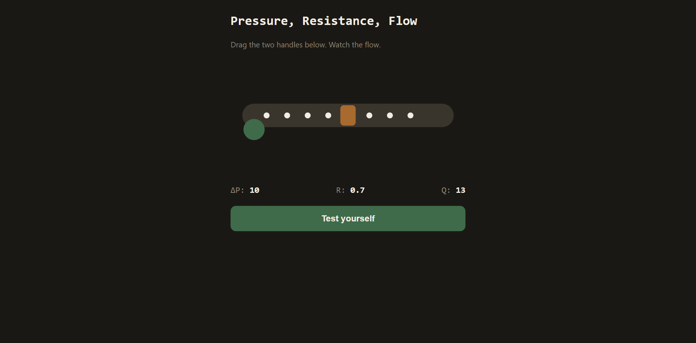

# CVS Flow

A tiny offline-first interactive tool for one specific, well-documented physiology misconception: how pressure gradient and resistance actually determine blood flow.

Between 95% and 99% of physiology and medical students answer this wrong, even after lectures on the topic. This tool exists because reading the equation does not fix the misconception. Manipulating it does.

## What it does

Drag two handles on a live tube diagram: one controls the pressure gradient, one squeezes the tube to change resistance. Watch particles speed up and slow down in real time as Q = ΔP / R plays out visually instead of staying an abstract formula.

Then it tests you with the exact scenario students get wrong most often: what happens to flow when resistance doubles but pressure stays the same. You predict first, then see the real answer.

## Why

Standard physiology teaching does not fix this misconception for most students. The interactive, hands-on version does, based on documented interventions using physical tubing rigs with adjustable clamps. This is that same interaction, in an installable offline app instead of a lab setup.

Built for students without reliable internet or the ability to pay for AI subscriptions to get this kind of interactive explanation. Works fully offline after first load.

## Try it

Live: https://cvs-flow.netlify.app

Or clone and open `index.html` directly, no build step, no dependencies.

## Stack

Plain HTML, CSS, and vanilla JS. No frameworks. Service worker caches everything for offline use. Installable as a PWA on Android and iOS.

## License

MIT
